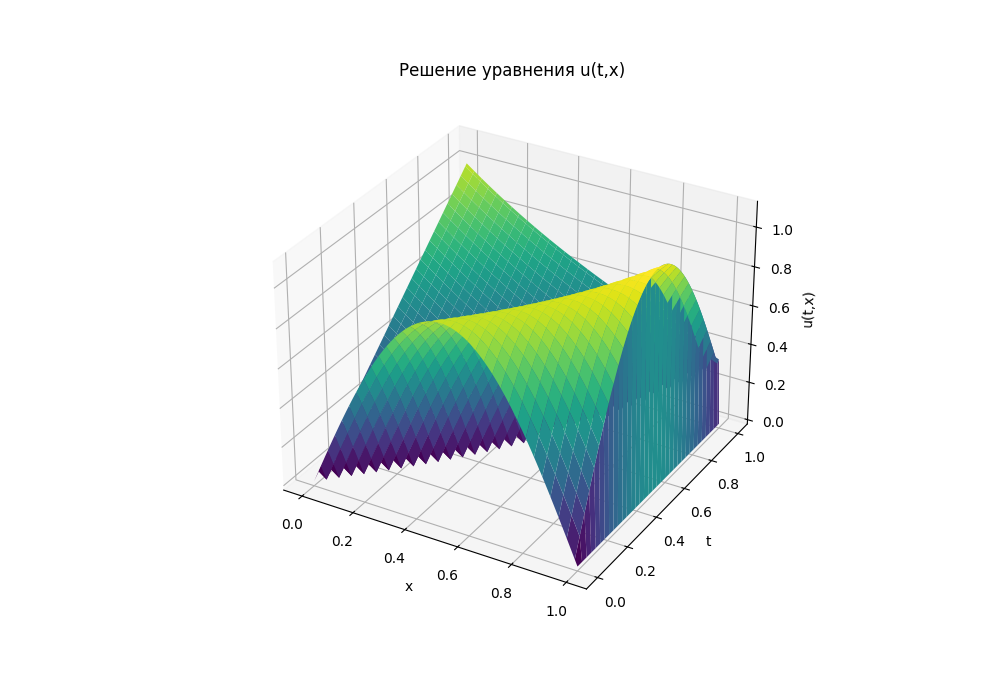
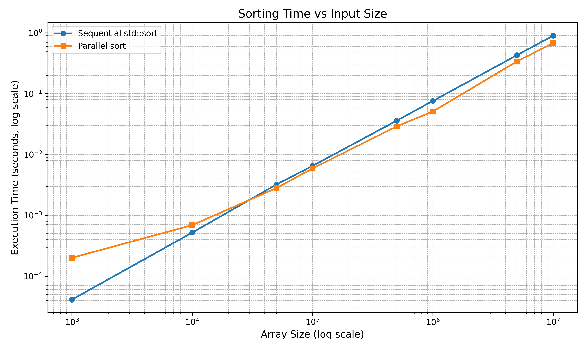

# Parallel Programming MIPT course


### Configuration

The training cluster consists of 3 nodes.

1 node – for queueing tasks and retrieving program results

2 nodes (8 cores each) – computing field (up to 16 MPI processes)
Memory 2 GB per core

### Lab 1

*Introduction to MPI*

#### Admission

**Task 1**: Calculate pi using MPI

**Results** (8 processes):

```bash
Calculated Pi = 3.141592653589816
Error = 2.264854970235319e-14
Time = 0.0643805230000000 seconds
```

**Task 2**: Measure time of communication between MPI nodes

**Results** (8 processes):

```bash
Number of iterations: 100
========================================
Message size: 0 bytes
Average round-trip time: 0.71008 μs
Estimated bandwidth: 0 Mbps
----------------------------------------
Message size: 1 bytes
Average round-trip time: 0.514295 μs
Estimated bandwidth: 15.5553 Mbps
----------------------------------------
Message size: 16 bytes
Average round-trip time: 0.6928 μs
Estimated bandwidth: 184.758 Mbps
----------------------------------------
Message size: 64 bytes
Average round-trip time: 0.60652 μs
Estimated bandwidth: 844.16 Mbps
----------------------------------------
Message size: 256 bytes
Average round-trip time: 0.896325 μs
Estimated bandwidth: 2284.89 Mbps
----------------------------------------
Message size: 1024 bytes
Average round-trip time: 1.48555 μs
Estimated bandwidth: 5514.44 Mbps
----------------------------------------
Message size: 4096 bytes
Average round-trip time: 9.62949 μs
Estimated bandwidth: 3402.88 Mbps
----------------------------------------
Message size: 16384 bytes
Average round-trip time: 14.9193 μs
Estimated bandwidth: 8785.42 Mbps
----------------------------------------
Message size: 65536 bytes
Average round-trip time: 31.3336 μs
Estimated bandwidth: 16732.4 Mbps
----------------------------------------
Message size: 262144 bytes
Average round-trip time: 101.447 μs
Estimated bandwidth: 20672.3 Mbps
----------------------------------------
Message size: 1048576 bytes
Average round-trip time: 357.278 μs
Estimated bandwidth: 23479.2 Mbps
----------------------------------------

```

#### Task

**Task**: Solve transport equation



Serial version time: T₁ = 0.011205 sec

Parallel version time: Tₚ= 0.002228 sec

Speedup: S = T₁ / Tₚ  = 5.03

Efficiency: E = S / p = 62.9% (p = 8)


### Lab2

*Introduction to POSIX threads, synchronization primitives and processes communication*

#### Admission

**Task 1**: Write parallel sort using threads and compare it with standard quick sort

**Results**:



**Task 2**: Measure communication time between processes (through pipe) and between threads

**Results**:

```bash
Avg round-trip time (pipe): 61.632 µs
Avg round-trip time (threads): 51.261 µs;
```

#### Task

Parallel computation of the integral of sin(1/x) from 0.01 to 10.
Best performance achieved with 5 threads due to balanced workload and dynamic task distribution.

| Threads | Time (s)  |
|---------|-----------|
| 1       | 0.008     |
| 2       | 0.019     |
| 3       | 0.015     |
| 4       | 0.017     |
| **5**   | **0.007** |

